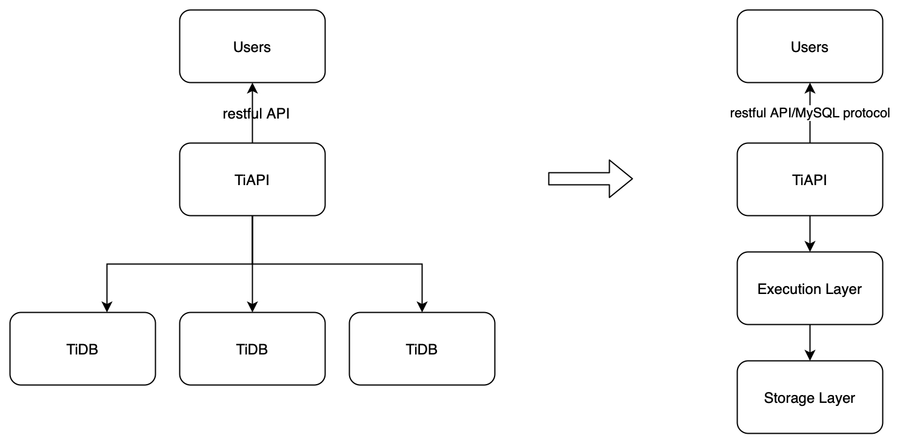

# TiAPI (TiDB hackathon 2021 project)

## Authors

@zhangyangyu @Lweb @7houce @haicoder

## Introduction

TiAPI is a standalone service providing restful API to execute SQL statements on TiDB to users. It's an experimental project making TiDB more serviceless. With TiAPI, the real TiDB instances are transparent to end users. This frees users from management duties of database instances and offers more flexibility to the database providers of upgrading and other management things.

## Architecture



## Background

Although TiDB is already a multi-tenant distributed database system, it still follows the traditional instance(cluster) concept. Everyone, no matter what roles they are, users or administrators, has to know the endpoint of each instance to connect correctly, take the duty to monitor and upgrade the cluster, even under the modern traditional cloud service model. Cloud and serverless establish a new model and opportunity to database systems. Under the new model, users have no need to care about management things and service providers could reduce their product versions and environments and make management easier.

To achieve the final goal, TiDB architecture needs to be more cloud native. A rough direction is splitting into more microservices and using more cloud services. This helps reduce costs, enhance scalability and improve security.

However, splitting TiDB functionalities and codebase is not an easy task, especially for hackathon work. So we choose adding another layer, TiAPI, to make a small step first, mimic the final architecture. Actually this might be a promising way, first having a working service and then deleting unnecessary codes from the large codebase.

## Usage

```shell
curl -X POST https://127.0.0.1:8080/user -H 'content-type: application/json' -d '{"username": "test", "password": "test", "database": "test"}'
```

First you need to call the `user` API to create a user and its database. If the user already exists, it returns a working session via `X-Session-Id`.

```shell
curl -X POST https://127.0.0.1:8080/api/statements -H 'content-type: application/json' -d '{"statement": "select * from a"}' -H 'x-session-id: 5b94e69c-1c7d-4aa5-8a55-45ca9b135a2c'
```

With the working session, you could call the `statements` API to execute any SQL. The SQL statements are executed under the corresponding database in the session. Data rows are returned if everything works as expected while `422` http code returned when there is error.
